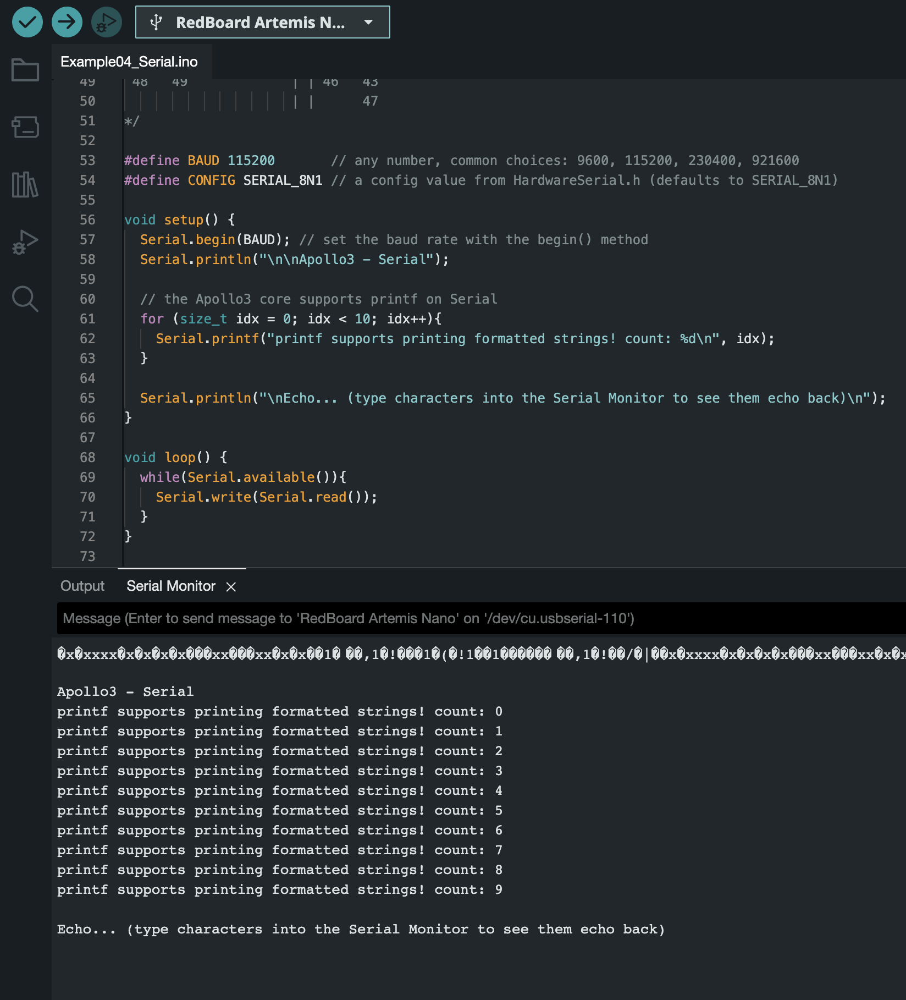
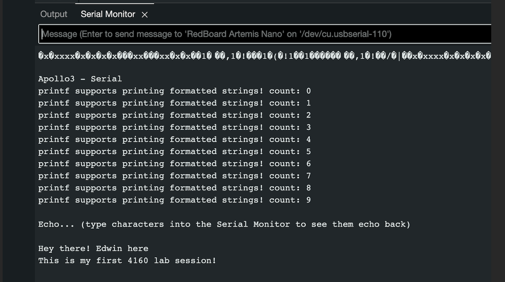
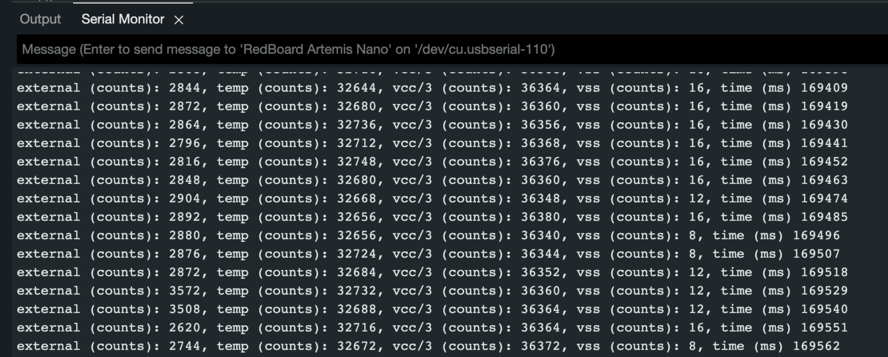
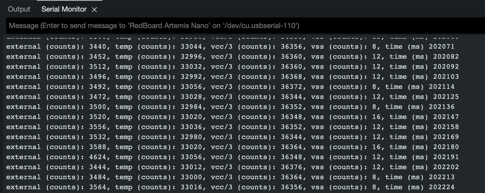
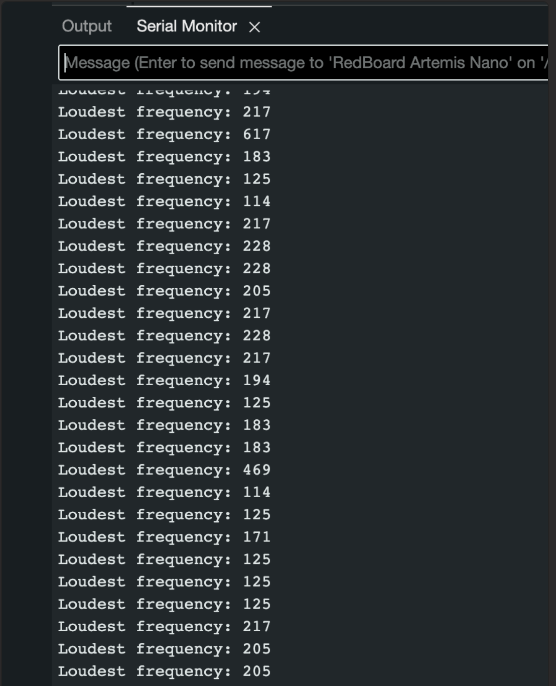
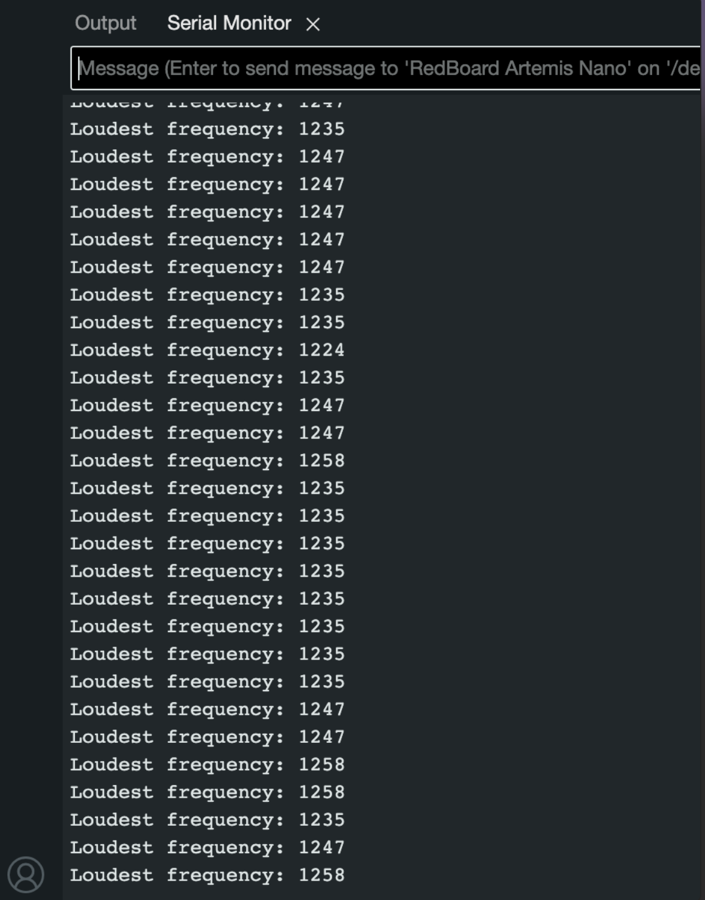
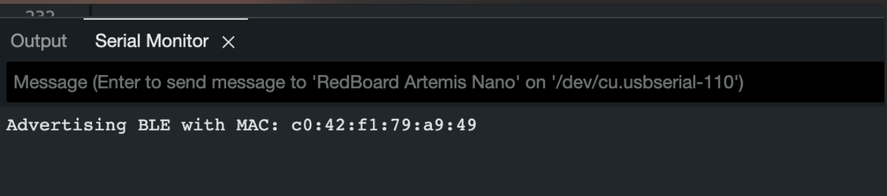
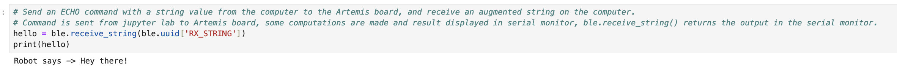
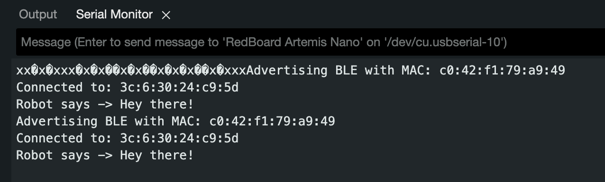
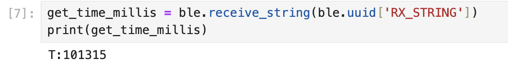

# All Labs 
* [LAB 1 - The Artemis Board and Bluetooth](README.md) 
* [LAB 2 - IMU](docs/lab2.md)  
* [LAB 3 - Time-of-flight Sensors](docs/lab3.md)
* [LAB 4 - Motors and Open Loop Control](docs/lab4.md)
* [LAB 5 - Linear PID control and Linear interpolation](docs/lab5.md)
* [LAB 6 - Orientation Control](docs/lab6.md)
* [LAB 7 - Kalman Filter](docs/lab7.md)
* [LAB 8 - Stunts](docs/lab8.md)
* [LAB 9 - Mapping](docs/lab9.md)
* [LAB 10 - Grid Localization using Bayes Filter](docs/lab10.md)
* [LAB 11 - Localization on the real robot](docs/lab11.md)
* [LAB 12 - Path Planning and Execution](docs/lab12.md)

# LAB 1: THE ARTEMIS BOARD AND BLUETOOTH

This lab was divided into two parts. The first part of the lab was meant to help us familiarize ourselves with the Arduino IDE ad the Artemis board. The second part of the lab had to do with establishing communication between your computer and teh Artemis board through bluetooth. 

<b>PARTS REQUIRED</b> 
- 1 x SparkFun RedBoard Artemis Nano
- 1 x USB C-to-C or A-to-C cable

## PART 1 
In Part 1, we aimed to set up and familiarize ourselves with the Arduino IDE and the Artemis board.

First, we installed the Arduino IDE, updating it if necessary. Then, we ensured compatibility with the SparkFun RedBoard Artemis Nano board by installing the <em>SparkFun Apollo3 Arduino Core</em> via the Additional Board Manager URL feature in the IDE. Following this, we installed the latest version of the SparkFun Apollo3 board package using the IDE's board manager tool.

With the SparkFun Artemis board definitions in place, we selected "RedBoard Artemis Nano" from the list of SparkFun Apollo3 boards. This completed our setup.

We then proceeded to test the board with simple projects.

### Blink It Up!  
This example was more like a proof of concept as its implementation is very simple and can be immediately verified on the board. I hooked up the Artemis board to my computer via the  USB C-to-C cable and loaded the "Blink" project in the Built-in Examples section in the Arduino IDE onto the board.  

#### Implementation 
The "Blink" code toggles the board's built-in LED pin between 'HIGH' and 'LOW' states with a 1000ms (1 second) delay, creating a blinking effect. Implemented in the void loop, this process repeats indefinitely, resulting in the LED blinking continuously.

To execute the "Blink" project, I first verified the code to ensure proper compilation and then uploaded it onto the Artemis board. Upon completion of the upload process, the blue LED begins blinking as intended.

#### Video  
[Built-in LED blinking](https://imgur.com/SngHCKx)  

#### Sample Code in Void loop

```
void loop() {
  digitalWrite(LED_BUILTIN, HIGH);  // turn the LED on (HIGH is the voltage level)
  delay(1000);                      // wait for a second
  digitalWrite(LED_BUILTIN, LOW);   // turn the LED off by making the voltage LOW
  delay(1000);                      // wait for a second
}
```

### Example4_Serial - Using the Serial monitor 
For this example, I navigated to "Examples for RedBoard Artemis Nano" and selected "Example4_Serial" under Apollo3. I verified the code and uploaded it onto the board. 
Initially, when I uploaded the code onto the board, and pulled up the Serial Monitor, "gibberish" was displayed in the monitor. To fix this, the TA suggested increasing the baud rate so I tried adjusting the baud rate (rate of data transmission across the serial channel). Initially, the baud rate was around 9600, so I bumped it up gradually till I settled on 115200 baud. At this baud rate, I finally got intelligible outputs. 

In the Serial Monitor, I was able to type some inputs and they were displayed directly in the Serial monitor after the outputs from uploading "Example4_Serial". See below for pics. 






### Example2_analogRead - Testing the temperature sensor 
This example was meant to test the on-board temperature sensor. After verifying and uploading this code onto the board, I pulled up the Serial monitor to see the temperature values being read by the temperature sensor on the board. 

#### Test 1 - Finger on chip
To test the sensor, I decided to press my index finger on the chip to transfer heat and thus increase the temperature being read by the sensor. I did this for a while and did not observe an appreciable increase in the temperature readings. 

#### Test 2 - Blowing hot air on chip
In an attempt to observe an appreciable change in the temperature, I proceeded to blow hot air onto the board instead. After a few seconds of doing this, I observed a slight change in the readings. See below for before and after pics. 

##### Before blowing on chip  


##### When blowing on chip  


From the pics above, you would observe that the temperature readings changed from "32- - -" to "33- - -" after hot air was blown onto the board. 

### Example1_MicrophoneOutput - Testing the microphone 
After uploading the code onto the board, I pulled up the serial monitor and observed the microphone frequency readings. Due to the ambient noise i the lab, the lowest frequency I observed had a magnitude of about 125. 
To test the microphone, I brought my mouth close to the board and started speaking. Immediately, I noticed appreciable changes in the frequency recorded. I wanted to record a higher frequency so I tried whistling too and the results were even more noticeable. By whistling, I was able to get the loudest frequency recorded to about 1258 from around 912 (through speaking). See below for microphone readings 

#### Before speaking   


#### During speaking  


## PART 2 
The purpose of part two of this lab is to establish communication between your computer and the Artemis board through the Bluetooth stack.

### Computer Setup 
#### Install Python
I already had a python installation so I just re-verified that it was at least version 3.7

#### Install Venv and using virtual environment
Here, I used <em>pip</em> to install <em>venv</em> for Python by running ```python3 -m pip install --user virtualenv```. I then navigated to my project directory and created a virtual environment. 
After the virtual environment was created, I activated it and proceeded to install the relevant python packages for the environment by running ```pip install numpy pyyaml colorama nest_asyncio bleak jupyterlab``` 

With the package installation done, I followed the lab instructions for unzipping the codebase into my project directory and got jupyter lab running. 

#### Updating Artemis MAC Address 
After burning my ble_arduino.ino sketch into the Artemis board, the board printed its MAC address in the serial monitor. And, during configuration, I replaced the Artemis address in the "connections.yml" file with this same MAC address. 



To test the robot's sensors more effectively, I carried out the following tasks. 

### ECHO COMMAND 
This task involves sending string data from the computer (in jupyter lab) to the Artemis board, where the data sent is processed (on the Artemis side) such that the computer receives back an augmented version of the data. 

Implementation
In the ECHO case in my ble_arduino.ino file, I stored the string data that will be received from the computer and used that data to create a response that will be sent back to the computer. See code below

```
tx_estring_value.clear();
tx_estring_value.append("Robot says -> ");
tx_estring_value.append(char_arr);
tx_characteristic_string.writeValue(tx_estring_value.c_str());
Serial.println(tx_estring_value.c_str());
```

  

  

In the code above, "Hey there!" is sent to the Artemis, "Robot says -> " is appended to get an augmented output which is received on the Python side when ```ble.receive_string(ble.uuid['RX_STRING'])``` is called. "Robot says -> Hey there!" is displayed in the serial monitor and also returned when the code above is called in jupyter lab. 

### GET_TIME_MILLIS
We want to be able to get timestamped messages from the Artemis board so being able to get the time in milliseconds is important. This task involves writing a string like "T:123456" to the string characteristic. 

#### Implementation
I created a <em>GET_TIME_MILLIS</em> command in my ble_arduino.ino file, used the <em>append</em> method to write "T:"  and the current time in milliseconds (i.e. 123456) to the EString, then packaged that entire string (i.e "T:123456") to be transmitted to the computer by using the <em>writeValue</em> method. See below for code snippet for GET_TIME_MILLIS command

```
tx_estring_value.clear();
tx_estring_value.append("T:");
tx_estring_value.append((int)millis());
tx_characteristic_string.writeValue(tx_estring_value.c_str());
Serial.println(tx_estring_value.c_str());
```

  

### NOTIFICATION HANDLER
When the <em>GET_TIME_MILLIS</em> command is called, the computer gets a string of the form "T:XXXXXX" from the Artemis board where "XXXXXX" is the time. We want to be able to get the time from the string received, so implemented a notification handler that essentially receives the string, splits it at the <em>":"</em> character and extracts the second part of the string, which is the time in this case. I have a helper function <em>extract_time()</em> that I use in my notification handler for parsing the string received and extracting the time. Due to the amount of data been received, the notifcation handler stores the time string in an array that is defined in the global scope and can be accessed easily. 

``` 
def notification_handler(uuid, byte_array_data):
    global time_data
    string_value = ble.bytearray_to_string(byte_array_data)
    extracted_time = extract_time(string_value) 
    time_data.append(extracted_time)
```

### GET CURRENT TIME 
For this task, we had to collect and send the current time in milliseconds from Artemis to the computer to be processed by the notification handler. 

#### Implementation 
I created the command "GET_CURRENT_TIME" which consists of a while loop that runs for five seconds, collecting the current time in milliseconds and sending it to the computer to be handled by the notification handler. The string sent to the computer is of the form <em>"T:<current time>"</em>. While the current time is of type 'long', I converted to int before sending the data. 

```
case GET_CURRENT_TIME:
  previousMillis = millis();
  while (millis() - previousMillis < 5000) {
    tx_estring_value.clear();
    tx_estring_value.append("T:");
    tx_estring_value.append((int)millis());
    tx_characteristic_string.writeValue(tx_estring_value.c_str());
          }
```

In order to find the data transfer rate, I stored the timestamps received in a Python list, and calculated the total number of strings received as well as the total number of bytes Using the first and last timestamps in the list, I was able to calculate the time elapsed. With the time elapsed and number of strings sent to the conputer, I calculated the data transfer rate. I calculated the total number of bytes by assuming each string has the ble transfer size limitation of 150 bytes. 

##### Effective data transfer rate  
  


### STORE TIMESTAMPS 
In the "GET_CURRENT_TIME" command, each timestamp was sent individually from Artemis to the computer over a certain time period. For this task, instead of sending each string one by one, I stored all the timestamps in an array and implemented the "SEND_TIME_DATA" command to loop through this array and send each string to the computer to be processed by the notification handler. 

#### Implementation 
First, I implemented a <em>"STORE_TIME"</em> command that populates an array of fixed size in the global scope with the time stamps. Then, I implemented the <em>"SEND_TIME_DATA"</em> command to loop through this array and send the string data to the computer. I used an array size of 1500 for my implementation. On the Python size (in jupyter lab), I was able to collate all the string data received and verify that all the data has been received. 


### GET TEMPERATURE READINGS 
This task is similar to the storing time stamps task, so the implementation is alike. Here, I instantiated an array of the same size as that for collating timestamps, then in my "STORE_TIME" command, I also collated the current temperature and stored it in my temperature array which is defined in the global scope just like the time array. 
Then, in my "GET_TEMP_READINGS" command, I created an EString of the form <em>"<time stamp>-<temperature>"</em> by looping through the temperature and time arrays, and transmitted it to the computer. To extract the time and temperature and store it in different arrays, I implemented a new notification handler to parse strings with the new format specified above. My notification handler uses a helper function (extract_temp_time()) that extracts the time and temperature data. See code snippet below. 

#### Notification handler  
```
def notification_handler_2(uuid, byte_array_data):
  string_value = ble.bytearray_to_string(byte_array_data)
  extracted_info = extract_temp_time(string_value)
  if extracted_info and len(extracted_info) == 2:
      time_val, temp_val = extracted_info[0], extracted_info[1]
      times.append(time_val)
      temps.append(temp_val)
```
#### Data transfer rate 


### Differences between the two methods of sending the time and temperature data 
The first method involves transmitting timestamps as they are generated, offering real-time updates crucial for immediate responses in applications requiring real-time data. This method minimizes latency between data generation and transmission, with minimal buffering delays. Additionally, it conserves memory as timestamps are not stored, ensuring efficient memory usage.

Contrarily, the second method necessitates storing timestamps, consuming memory resources. Transmitting data under this method incurs considerable latency as timestamps are buffered before transmission. There's also a risk of exceeding memory limits, especially with large datasets.

Comparative analysis, based on calculated effective data transmission rates (refer to related pictures above), indicates that storing data before transmission significantly outperforms transmitting data as it's generated. The raw data suggests that the second method of transmission may be approximately 45 times faster than the first method.

If the Artemis board has a RAM capacity of <em>384kB</em>, it will exhaust its memory after storing approximately <em>2560 strings</em>, assuming each string reaches the maximum size of around 150 bytes.

### Communication between computer and Artemis 
The computer communicates with the Artemis board via Bluetooth® LE, which is optimized for low power usage, making it ideal for the Artemis. The Artemis contains an onboard BLE module enabling it to connect with BLE-enabled computers. It advertises its presence through advertising packets, allowing the computer to establish a connection. Once connected, the computer communicates exclusively with the Artemis board using its MAC address. The Artemis acts as a bulletin board, updating and transmitting information, while the computer, acting as the central device, reads any data posted by the board. In jupyter lab, we use a command like <em>ble.connect()</em> to establish a connection with an Artemis board with the MAC address specified in the <em>connections.yml</em> file, and use several <em>ble commands</em> to receive different kinds of data (i.e. strings, integers, floats, etc) from the Artemis board. 


### Codebase 
On the Python side, the <em>demo.ipynb</em> file houses our Python code for interacting with the Artemis board. It includes code for establishing and terminating connections with the Artemis, as well as handling data transmission and reception, among other functionalities. Within our project, we also maintain the <em>cmd_types.py</em> file. This file is where we add mappings for new commands that facilitate communication, enable changes, or trigger actions on the Artemis side. And, <em>ble.py</em> and <em>base_ble.py</em> contains several ble commands like <em>connect()</em>, <em>disconnect()</em>, <em>start_notify()</em>, and <em>receive_string()</em> among other useful commands.  

On the Artemis side, we have the <em>ble_arduino.ino</em> file which contains all the code that is compiled and run on the Artemis board. The other files primarily contain class definitions for functionalities such as data transmission and reception, as well as manipulation of character arrays.

### Discussion
Working on this lab has been both enjoyable and enlightening. While navigating the code base posed initial challenges in understanding the functionality of each segment, referring to the lab instructions effectively addressed many of the encountered issues (i.e. the serial monitor displaying gibberish because of a low baud rate). Diligent reading of the lab manual proved invaluable. As much of the lab's content was novel to me, it served as a rich source of learning experiences. I found exploring BLE and the data exchange between the computer and the Artemis board particularly engaging. 

### Other Labs  
* [LAB 2 - IMU](docs/lab2.md)  
* [LAB 3 - Time-of-flight Sensors](docs/lab3.md)
* [LAB 4 - Motors and Open Loop Control](docs/lab4.md)
* [LAB 5 - Linear PID control and Linear interpolation](docs/lab5.md)
* [LAB 6 - Orientation Control](docs/lab6.md)
* [LAB 7 - Kalman Filter](docs/lab7.md)
* [LAB 8 - Stunts](docs/lab8.md)
* [LAB 9 - Mapping](docs/lab9.md)
* [LAB 10 - Grid Localization using Bayes Filter](docs/lab10.md)
* [LAB 11 - Localization on the real robot](docs/lab11.md)
* [LAB 12 - Path Planning and Execution](docs/lab12.md)
 
