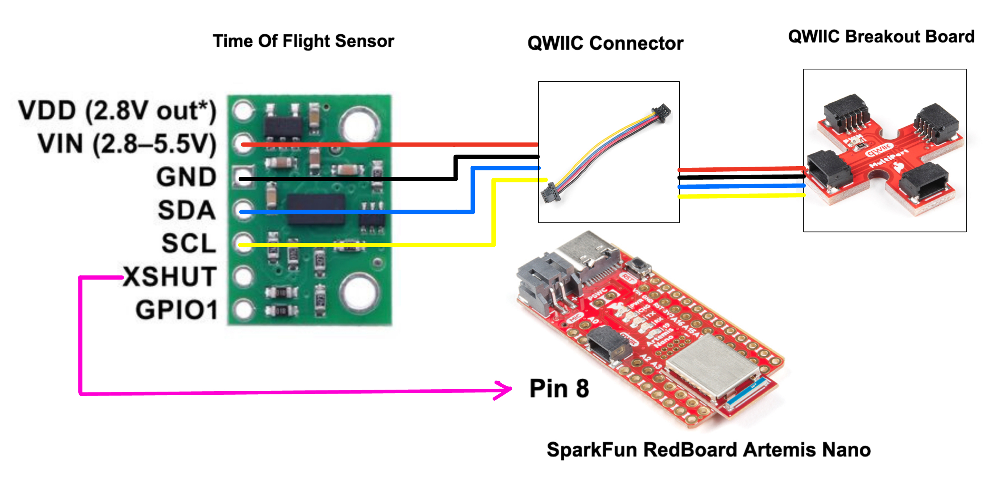

# LAB 3: TIME OF FLIGHT SENSORS

This purpose of this lab is to equip the robot with time of flight sensors to enable it judge distances accurately in order to avoid running into obstacles and perform stunts. 

<b>PARTS REQUIRED</b> 
- 1 x SparkFun RedBoard Artemis Nano
- 1 x USB C-to-C or A-to-C cable
- 2 x 4m Time of Flight Sensors
- 1 x QWIIC Breakout board
- 2 x QWIIC connectors 

## The Time of Flight Sensors 
The time of flight sensors used for this lab are two VL53L1X sensors and wiring them was fairly straightforward as we just needed to refer to the specifications sheet and connect the right wires on the QWIIC connectors to the right pins on the sensors. The pins on the sensors were labeled so this task involved connecting Vin, GND, SDA, SCL, and XSHUT pins to the designated pins.
 

For hooking up multiple sensors, the QWIIC breakout board came in handly. The breakout board was first powerered via a QWIIC cable thus providing three extra connection points for other sensors. I connected both Time of Flight (TOF) sensors to the Artemis via two QWIIC connection terminals on the breakout board.  
  

In the picture above, you can see the two time of flight sensors connected via the breakout board. See below for picture of sensors working in parallel.  
  

### Schematic  
The Time of Flight sensors were integrated with the Artemis board following the schematic depicted below. During the wiring process, one of the sensors was outfitted with an XSHUT pin, which proved useful for I2C address assignment. Given the requirement for two time of flight sensors, we had to use the QWIIC breakout board (multiport) to expand the number of available ports, especially considering the need to also connect the IMU to the Artemis board.  

  

To set up the wiring, we simply linked the VIN, GND, SDA, and SCL pins of the time-of-flight sensor to their corresponding pins on the breakout board, adhering to the QWIIC connector schematic provided. The wires integrated into the QWIIC connectors were color-coded, simplifying the matching process during the setup.


### I2C Sensor Address 
When the first Time of Tlight sensor was connected to the board, its address was printed in the serial monitor after it was detected during scanning. Per the sensor manual, the address of the sensor is supposed to be <em>0X52</em> but the address displayed was <em>0X29</em>. There was no cause for alarm at this point as <em>0X29</em> was simply the default address of <em>0X52</em> bitshifted to the right. 


The recorded sensor address of <em>0X29</em> identified the Time of Flight sensor on the I2C bus we run into a problem since we are using two TOF sensors. If the two sensors are connected to the board, they will have the same address. This will be problematic as we would not be able to distinguish between them and as such not be able to work with them independently. Of course, the solution to this problem is to find a way to give one of the TOF sensors a different address, so that's what we did. 

The implementation involved shutting down one of the TOF sensors, assigning a new address and turning it back on. The active-low XSHUT pin connected to one of the TOF sensors made this possible as we had to just set it to low to turn off the sensor. See image below for serial output of I2C addresses before and after assignment.  

```
...
  pinMode(SHUTDOWN_PIN, OUTPUT); 
  digitalWrite(SHUTDOWN_PIN, LOW);
  check_tof_online(distanceSensor1, "1"); 
  Serial.println("Sensor #1 online!"); 
  distanceSensor1.setI2CAddress(SENSOR2_ADDRESS);  
  digitalWrite(SHUTDOWN_PIN, HIGH);
  check_tof_online(distanceSensor2, "2"); 
  Serial.println("Sensor #2 online!");
...
```

  

### Sensor placement 
To ensure accurate obstacle detection, sensor placement is critical. I positioned one sensor at the front and another at the back of the car. This setup enables the robot to detect obstacles from both its front and rear positions, providing comprehensive situational awareness. Alternatively, installing both sensors at the front would have limited the robot's detection capabilities to only the front, potentially leaving blind spots at the rear.

### Time of Flight Sensor Modes 
The TOF sensor has some flexibility in the mode for taking measurements based on the range needed. You can either set the distance ranging mode to short or long via the <em>setDistanceModeShort()</em> and <em>setDistanceModeLong()</em> methods. I decided to go with the short distance mode because I figured if the robot is going to be performing stunts, I want it to be maximally sensitive and accurate. The long distance mode sacrifices sensitivity to ambient noise for greater range so the short distance mode was a better option in this case. 

### Short Distance Mode Statistics
#### Range: 10mm - 1686 mm 
To determine the range, I aimed my TOF sensors at a nearby wall and steadily moved backward until they were out of range. I recorded the distances measured by the TOF sensors at the instant they were out of range multiple times and averaged the results to establish the farthest range which was about <em>1686 mm</em>. 

#### Repeatability
Here, I took 10 separate measurements at distances of 1500mm and 500mm to ascertain how repeatable the measurements are. In both measurements, the measured data was around the same value but with deviations of up to 4mm. In the 1500mm case, most of the measured distances deviated from the expected value by only 1mm, and in the 500mm case, it was about 1 - 2mm. 
  

#### Accuracy: 1.8mm
Using the same data from the repeatability measurements, I averaged the deviations from the measurements and calculated the accuracy to be around 4mm of the expected value.  


### Time of Flight Sensor Speed
Here, at every iteration of the main loop, I tranmitted time stamps over BLE whenever the TOF sensors are collating data. Using about 100 of these time stamps, I computed the differences between each time stamp and the previous one. With this data, I was able to approximate the rate at which the TOF sensors were sampling values.  

  

From the image above, the TOF sensors were sampling values approximately once every <em>863 milliseconds</em> which is about 29000 times slower than the rate at which the main loop is running. 

The code implementation just consists of an if statement that checks if we have collated 100 time stamps or not and appends the current time to an array.  

```
  ...
  tofData1[tof_index] = distance1; 
  tofData2[tof_index] = distance2; 
  if (tof_speed_index < 100){
    tofSpeed[tof_speed_index] = (int) millis(); 
    tof_speed_index++; 
  }
  ...
```

### Time of Flight Sensor Data over BLE
After successfully configuring the two time-of-flight sensors, I initiated their operation, collected distance measurements over a specified duration, and transmitted timestamped distance data via BLE to the computer. The resulting plot displays data from 530 recorded points.  


### Thoughts
I thoroughly enjoyed the lab, although I faced a persistent bug while trying to integrate my time-of-flight sensors into my main ble_arduino.ino file. Initially encountering a HardFault Exception, I used debugging print statements and traced the issue to the <em>distanceSensor.startRanging()</em> method. Half of the problem was resolved, but identifying the cause of the method failure proved challenging. Despite the time-of-flight sensor code functioning in the Example1_ReadDistance file, reviewing every line in my .ino file yielded no solutions. Fortunately, Prof. Jaramillo clarified the address assignment process for time-of-flight sensors, prompting me to reorder the TOF setup commands. By ensuring the first TOF sensor was online before altering its address—unlike my previous code, which skipped this check—I successfully resolved the issue. Debugging my sensors constituted a significant aspect of this lab, providing an enriching learning experience as I delved deeper into troubleshooting and problem-solving methodologies.


### Other labs
* [LAB 4](lab4.md)
* [LAB 5](lab5.md)
* [LAB 6](lab6.md)
* [LAB 7](lab7.md)
* [LAB 8](lab8.md)


